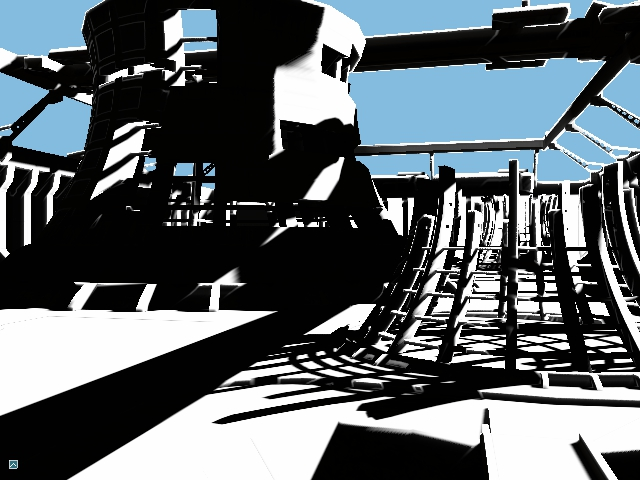

# Rendering Components

Rendering components are designed to be plug-and-play blocks of functionaliy that can be used by applications.

## Shadows



The shadowing component implements the following BKMs:

- Cascaded shadow maps with cascade stabilization
- PCF
- Variance shadow maps
- Two and four-component exponential variance shadow maps
- Optimized fixed-size or world-sized filter kernels
- Best cascade search based on projection into light space
- Filtering across cascades
- Various artifact removal techniques

### Integrating shadows into application

The component is implemented by the following source files:

- [ShadowMapManager.h](interface/ShadowMapManager.h)/[ShadowMapManager.cpp](src/ShadowMapManager.cpp) - implementation of the shadow map manager.
- [Shadows.fxh](../Shaders/Common/public/Shadows.fxh) - shader functionality.

#### Initialization
The shadow map manager is responsible for creating required textures and views, cascade partitioning, converting shadow map to filterable 
representations (VSM/EVSM) etc.

To initialize the manager, prepare `ShadowMapManager::InitInfo` structure that defines initialization parameters
and call `ShadowMapManager::Initialize`, for example:

```cpp
ShadowMapManager::InitInfo SMMgrInitInfo;
SMMgrInitInfo.Format               = TEX_FORMAT_D16_UNORM;
SMMgrInitInfo.Resolution           = 1024;
SMMgrInitInfo.NumCascades          = 4;
SMMgrInitInfo.ShadowMode           = SHADOW_MODE_PCF;
SMMgrInitInfo.pComparisonSampler   = m_pComparisonSampler;
m_ShadowMapMgr.Initialize(m_pDevice, SMMgrInitInfo);
```

Most of the fields of `ShadowMapManager::InitInfo` structure are self-explanatory. `pComparisonSampler` defines
optional texture sampler to be set in the shadow map resource view. If the sampler is `null`, the application is responsible
for setting appropriate sampler before using the shadow map in the shader.

#### Cascade Partitioning

To distribute shadow map cascades, populate `ShadowMapManager::DistributeCascadeInfo` that defines partitioning
parameters and call `ShadowMapManager::DistributeCascades`:

```cpp
ShadowMapManager::DistributeCascadeInfo DistrInfo;
DistrInfo.pCameraView         = &m_Camera.GetViewMatrix();
DistrInfo.pCameraProj         = &m_Camera.GetProjMatrix();
DistrInfo.pLightDir           = &m_f3LightDirection;
DistrInfo.fPartitioningFactor = 0.95f;
m_ShadowMapMgr.DistributeCascades(DistrInfo, m_LightAttribs.ShadowAttribs);
```

`fPartitioningFactor` member defines the ratio between fully linear (0.0) and 
fully logarithmic (1.0) partitioning. The method populates the `ShadowMapAttribs` structure that
is part of the `LightAttribs` structure and should be made available to a shader via constant buffer.

#### Rendering Shadow Cascades

After cascades are distributed, use `ShadowMapManager::GetCascadeTranform` method to access
transform matrices and render every cascade:

```cpp
auto iNumShadowCascades = m_LightAttribs.ShadowAttribs.iNumCascades;
for(int iCascade = 0; iCascade < iNumShadowCascades; ++iCascade)
{
    const auto CascadeProjMatr = m_ShadowMapMgr.GetCascadeTranform(iCascade).Proj;

    auto WorldToLightViewSpaceMatr = m_LightAttribs.ShadowAttribs.mWorldToLightViewT.Transpose();
    auto WorldToLightProjSpaceMatr = WorldToLightViewSpaceMatr * CascadeProjMatr;
    CameraAttribs ShadowCameraAttribs = {};
    ShadowCameraAttribs.mViewT     = m_LightAttribs.ShadowAttribs.mWorldToLightViewT;
    ShadowCameraAttribs.mProjT     = CascadeProjMatr.Transpose();
    ShadowCameraAttribs.mViewProjT = WorldToLightProjSpaceMatr.Transpose();

    {
        MapHelper<CameraAttribs> CameraData(m_pImmediateContext, m_CameraAttribsCB, MAP_WRITE, MAP_FLAG_DISCARD);
        *CameraData = ShadowCameraAttribs;
    }

    auto* pCascadeDSV = m_ShadowMapMgr.GetCascadeDSV(iCascade);
    m_pImmediateContext->SetRenderTargets(0, nullptr, pCascadeDSV,
                                          RESOURCE_STATE_TRANSITION_MODE_TRANSITION);
    m_pImmediateContext->ClearDepthStencil(pCascadeDSV, CLEAR_DEPTH_FLAG, 1.f, 0,
                                           RESOURCE_STATE_TRANSITION_MODE_TRANSITION);

    DrawMesh(m_pImmediateContext);
}
```

When using filterable represenations, the shadow map must be post-processed before it can be used in a shader: 

```cpp
if (m_ShadowSettings.iShadowMode > SHADOW_MODE_PCF)
    m_ShadowMapMgr.ConvertToFilterable(m_pImmediateContext, m_LightAttribs.ShadowAttribs);
```


#### Rendering with Shadows

To use shadowing functionality in the shader, include `BasicStructures.fxh` and `Shadows.fxh` files and
depending on the shadowing mode, define shadow map or filterable shadow map textures and corresponding samplers
(note that the names must be different to allow HLSL to GLSL conversion):

```hlsl
#include "BasicStructures.fxh"
#include "Shadows.fxh"

#if SHADOW_MODE == SHADOW_MODE_PCF
    Texture2DArray<float>  g_tex2DShadowMap;
    SamplerComparisonState g_tex2DShadowMap_sampler;
#else
    Texture2DArray<float4> g_tex2DFilterableShadowMap;
    SamplerState           g_tex2DFilterableShadowMap_sampler;
#endif
```

To filter shadow map, call `FilterShadowMap` or `SampleFilterableShadowMap` functions:

```hlsl
FilteredShadow Shadow;
#if SHADOW_MODE == SHADOW_MODE_PCF
    Shadow = FilterShadowMap(g_LightAttribs.ShadowAttribs, g_tex2DShadowMap, g_tex2DShadowMap_sampler,
                             VSOut.PosInLightViewSpace, VSOut.CameraSpaceZ);
#else
    Shadow = SampleFilterableShadowMap(g_LightAttribs.ShadowAttribs, g_tex2DFilterableShadowMap,
                                       g_tex2DFilterableShadowMap_sampler, VSOut.PosInLightViewSpace,
                                       VSOut.CameraSpaceZ);
#endif
DiffuseIllumination *= Shadow.fLightAmount;
```

Shadow filtering mode is controlled by a number of macroses that should be defined when creating the shader:

```cpp
ShaderCreateInfo ShaderCI;
ShaderMacroHelper Macros;
Macros.AddShaderMacro( "SHADOW_MODE",            m_ShadowSettings.iShadowMode);
Macros.AddShaderMacro( "SHADOW_FILTER_SIZE",     m_LightAttribs.ShadowAttribs.iFixedFilterSize);
Macros.AddShaderMacro( "FILTER_ACROSS_CASCADES", m_ShadowSettings.FilterAcrossCascades);
Macros.AddShaderMacro( "BEST_CASCADE_SEARCH",    m_ShadowSettings.SearchBestCascade );
ShaderCI.Macros = Macros;
```

[Shadows sample](https://github.com/DiligentGraphics/DiligentSamples/tree/master/Samples/Shadows) gives an example of
using the shadowing component.

### References

- [Variance Shadow Maps](http://www.punkuser.net/vsm/)
- [Layered variance shadow maps](http://www.punkuser.net/lvsm/lvsm_web.pdf)
- [Shadow sample update by MJP](https://mynameismjp.wordpress.com/2015/02/18/shadow-sample-update/)
- [MJP's shadows sample source code](https://github.com/TheRealMJP/Shadows)
- [Shadow Explorer sample from Intel](https://software.intel.com/en-us/articles/shadow-explorer-sample)
- [Cascaded Shadow Maps technical article by Microsoft](https://docs.microsoft.com/en-us/windows/win32/dxtecharts/cascaded-shadow-maps)
