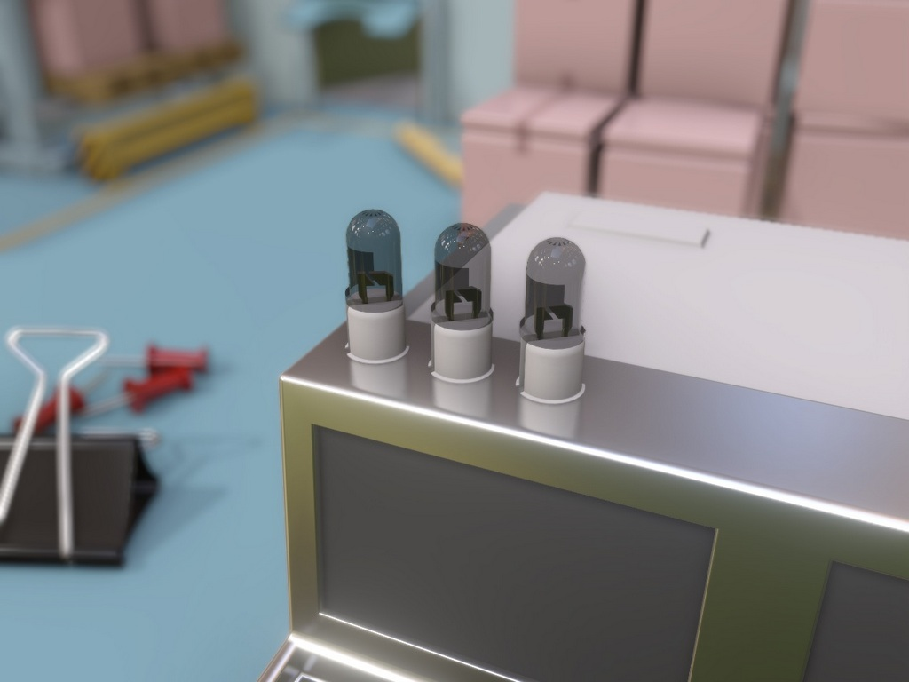

# Depth of Field



## Table of contents
- [Introduction](#introduction)
- [Integration guidelines](#integration-guidelines)
    - [Input resources](#input-resources)
    - [Host API](#host-api)
- [Implementation details](#implementation-details)
- [References](#references)

## Introduction

Depth of Field is a visualization technique used in photography and cinematography to create a sense of depth by focusing on certain objects, while keeping others out-of-focus and blurred. 
In real-time rendering, accurately calculating the depth of field effect is prohibitvely expensive. Rasterization uses a pinhole camera model that makes all objects in the frame equally sharp.
Therefore, in real-time rendering, depth of field is approximated by applying a blur effect to the final image, using the information from the depth buffer.

## Integration guidelines

### Input resources

The following table enumerates all external inputs required by the Depth Of Field effect.

| **Name**                          |  **Format**                        | **Notes**                                           |
| --------------------------------- |------------------------------------|---------------------------------------------------- |
| Color buffer                      | `APPLICATION SPECIFIED (3x FLOAT)` | The HDR render target of the current frame containing the scene radiance |
| Depth buffer                      | `APPLICATION SPECIFIED (1x FLOAT)` | The depth buffer for the current frame provided by the application. The data should be provided as a single floating-point value, the precision of which is under the application's control |


The effect uses a number of parameters to control the quality and performance organized into the `HLSL::DepthOfFieldAttribs` structure.
The following table lists the parameters and their descriptions.

| **Name**                                 | **Notes** |
| -----------------------------------------|-----------|
| `BokehRadius`                            | Intensity of the depth of field effect. |
| `FocusDistance`                          | Distance from the camera at which the depth of field effect is focused. |
| `FocusRange`                             | Range of distances from the focus distance at which the depth of field effect is applied. |

### Host API

To integrate Depth of Field into your project, include the following header files:

```cpp
#include "PostFXContext.hpp"
#include "DepthOfField.hpp"
```
```cpp
namespace HLSL
{
#include "Shaders/Common/public/BasicStructures.fxh"
#include "Shaders/PostProcess/DepthOfField/public/DepthOfFieldStructures.fxh"
} // namespace HLSL
```

Next, create the necessary objects:

```cpp
m_PostFXContext = std::make_unique<PostFXContext>(m_pDevice);
m_DOF           = std::make_unique<DepthOfField>(m_pDevice);
```

Next, call the methods to prepare resources for the `PostFXContext` and `DepthOfField` objects.
This needs to be done every frame before starting the rendering process.

```cpp
PostFXContext::FrameDesc FrameDesc;
FrameDesc.Index  = m_CurrentFrameNumber; // Current frame number.
FrameDesc.Width  = SCDesc.Width;         // Current screen width.
FrameDesc.Height = SCDesc.Height;        // Current screen height.
m_PostFXContext->PrepareResources(m_pDevice, FrameDesc, PostFXContext::FEATURE_FLAG_NONE);

m_DepthOfField->PrepareResources(m_pDevice, m_pImmediateContext, m_PostFXContext.get(), DepthOfField::FEATURE_FLAG_NONE);
```

Call the method `PostFXContext::Execute` to prepare intermediate resources necessary for all post-processing objects
dependent on `PostFXContext`. This method can take a constant buffer containing the current and previous-frame
cameras (refer to this code [[0](https://github.com/DiligentGraphics/DiligentSamples/blob/380b0a05b6c72d80fd6d574d7343ead77d6dd7eb/Tutorials/Tutorial27_PostProcessing/src/Tutorial27_PostProcessing.cpp#L164)] and [[1](https://github.com/DiligentGraphics/DiligentSamples/blob/380b0a05b6c72d80fd6d574d7343ead77d6dd7eb/Tutorials/Tutorial27_PostProcessing/src/Tutorial27_PostProcessing.cpp#L228)]).
Alternatively, you can pass the corresponding pointers `const HLSL::CameraAttribs* pCurrCamera` and `const HLSL::CameraAttribs* pPrevCamera` for the current
and previous cameras, respectively. You also need to pass the depth of the current and previous frames,
and a buffer with motion vectors in NDC space, via the corresponding `ITextureView* pCurrDepthBufferSRV`, `ITextureView* pPrevDepthBufferSRV`, and `ITextureView* pMotionVectorsSRV` parameters.

```cpp
PostFXContext::RenderAttributes PostFXAttibs;
PostFXAttibs.pDevice             = m_pDevice;
PostFXAttibs.pDeviceContext      = m_pImmediateContext;
PostFXAttibs.pCameraAttribsCB    = m_FrameAttribsCB;
PostFXAttibs.pCurrDepthBufferSRV = m_CurrDepthBuffer;
PostFXAttibs.pPrevDepthBufferSRV = m_PrevDepthBuffer;
PostFXAttibs.pMotionVectorsSRV   = m_MotionBuffer;
m_PostFXContext->Execute(PostFXAttibs);
```

To compute the depth of field effect, call the `DepthOfField::Execute` method. Before this, fill the `DepthOfFieldAttribs` and `DepthOfField::RenderAttributes` structures 
with the necessary data. Refer to the [Input resources section](#input-resources) for parameter description.

```cpp
HLSL::DepthOfFieldAttribs DOFSettings{};

DepthOfField::RenderAttributes DOFRenderAttribs{};
DOFRenderAttribs.pDevice         = m_pDevice;
DOFRenderAttribs.pDeviceContext  = m_pImmediateContext;
DOFRenderAttribs.pPostFXContext  = m_PostFXContext.get();
DOFRenderAttribs.pColorBufferSRV = m_ColorBuffer;
DOFRenderAttribs.pDepthBufferSRv = m_CurrDepthBuffer;
DOFRenderAttribs.pDOFAttribs     = &DOFSettings;
m_DOF->Execute(SSAORenderAttribs);
```

An `ITextureView` of the texture containing the depth of field result can be obtained using the `DepthOfField::GetDepthOfFieldTextureSRV` method.

## Implementation details

TBD

## References
- **[Jasper Flick,, 2018]**: Advanced rendering: Depth of Field - https://catlikecoding.com/unity/tutorials/advanced-rendering/depth-of-field/
- **[Steve Avery, 2016]**: Bokeh Depth of Field - https://pixelmischiefblog.wordpress.com/2016/11/25/bokeh-depth-of-field/
- **[Matt Pettineo, 2011]**: How To Fake Bokeh (And Make It Look Pretty Good)  https://therealmjp.github.io/posts/bokeh/
