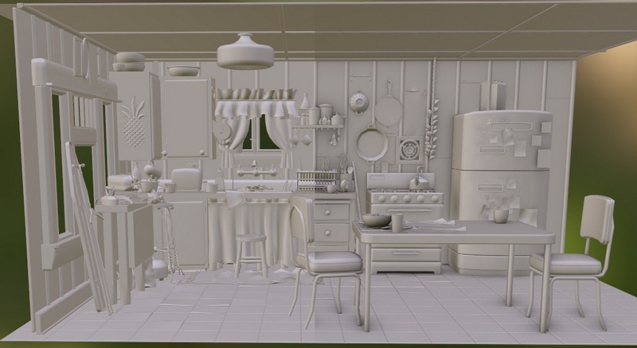

# Screen Space Ambient Occlusion



Kitchen scene rendered by [Hydrogent](https://github.com/DiligentGraphics/DiligentFX/tree/master/Hydrogent) with Screen Space Ambient Occlusion effect applied.


## Table of contents
- [Introduction](#introduction)
- [Integration guidelines](#integration-guidelines)
    - [Input resources](#input-resources)
    - [Host API](#host-api)
- [Implementation details](#implementation-details)
- [References](#references)

## Introduction

We needed to add screen space ambient occlusion to our project with the following requirements:
- Compatibility with WebGL
- Use cosine-weighted AO and have the ability to use a large radius

 We used Intel's implementation of Screen Space Occlusion as the basis for our implementation [**[Intel-XeGTAO]**](https://github.com/GameTechDev/XeGTAO)

## Integration guidelines

### Input resources

The following table enumerates all external inputs required by SSAO.

| **Name**                          |  **Format**                        | **Notes**                                           |
| --------------------------------- |------------------------------------|---------------------------------------------------- |
| Depth buffer                      | `APPLICATION SPECIFIED (1x FLOAT)` | The depth buffer for the current frame provided by the application. The data should be provided as a single floating point value, the precision of which is under the application's control. |
| Normal buffer                     | `APPLICATION SPECIFIED (3x FLOAT)` | The normal buffer for the current frame provided by the application in the [-1.0, +1.0] range. Normals should be in world space. |


The effect uses a number of parameters to control the quality and performance of the effect organized into the `HLSL::ScreenSpaceAmbientOcclusionAttribs` structure.
The following table lists the parameters and their descriptions.

| **Name**                                 | **Notes** |
| -----------------------------------------|-----------|
| Effect radius                            | World-space ambient occlusion radius. |
| Effect falloff range                     | Gently reduces sample impact as it gets out of the 'Effect radius' bounds. |
| Radius multiplier                        | Use different value as compared to the ground truth radius to counter inherent screen space biases. |
| Depth MIP sampling offset                | Controls the main trade-off between performance (memory bandwidth) and quality (temporal stability is the first affected, thin objects next). |
| Temporal stability factor                | The value is responsible for interpolating between the current and previous frame. |
| Spatial reconstruction radius            | Controls the kernel size in the spatial reconstruction step. Increasing the value increases the deviation from the ground truth but reduces the noise. |


The effect can be configured using the `ScreenSpaceAmbientOcclusion::FEATURE_FLAGS` enumeration. The following table lists the flags and their descriptions.

| **Name**                                 | **Notes** |
| -----------------------------------------|-----------|
| `FEATURE_FLAG_HALF_PRECISION_DEPTH`        | Use half-precision fixed-point format for depth values in the SSAO computation |
| `FEATURE_FLAG_HALF_RESOLUTION`             | Compute SSAO at half resolution of the target render texture |
| `FEATURE_FLAG_UNIFORM_WEIGHTING`           | By default, we compute AO using the GTAO algorithm. This flag enables the computation of AO using the HBAO algorithm |


### Host API

To integrate SSAO into your project, include the following necessary header files:
```cpp
#include "PostFXContext.hpp"
#include "ScreenSpaceAmbientOcclusion.hpp"
```
```cpp
namespace HLSL
{
#include "Shaders/Common/public/BasicStructures.fxh"
#include "Shaders/PostProcess/ScreenSpaceAmbientOcclusion/public/ScreenSpaceAmbientOcclusionStructures.fxh"
} // namespace HLSL
```

Now, create the necessary objects:
```cpp
m_PostFXContext = std::make_unique<PostFXContext>(m_pDevice);
m_SSAO          = std::make_unique<ScreenSpaceAmbientOcclusion>(m_pDevice);
```

Next, call the methods to prepare resources for the `PostFXContext` and `ScreenSpaceAmbientOcclusion` objects.
This needs to be done every frame before starting the rendering process.
```cpp
{
    PostFXContext::FrameDesc FrameDesc;
    FrameDesc.Index  = m_CurrentFrameNumber; // Current frame number.
    FrameDesc.Width  = SCDesc.Width;         // Current screen width.
    FrameDesc.Height = SCDesc.Height;        // Current screen height.
    m_PostFXContext->PrepareResources(m_pDevice, FrameDesc, PostFXContext::FEATURE_FLAG_NONE);

    ScreenSpaceAmbientOcclusion::FEATURE_FLAGS ActiveFeatures = ...;
    m_ScreenSpaceAmbientOcclusion->PrepareResources(m_pDevice, m_pImmediateContext, m_PostFXContext.get(), ActiveFeatures);
}
```

Now we invoke the method `PostFXContext::Execute`. At this stage, some intermediate resources necessary for all post-processing objects
dependent on `PostFXContext` are calculated. This method can take a constant buffer directly containing an array from the current and previous
cameras (for this method, you can refer to this section of the code  [[0](https://github.com/DiligentGraphics/DiligentSamples/blob/380b0a05b6c72d80fd6d574d7343ead77d6dd7eb/Tutorials/Tutorial27_PostProcessing/src/Tutorial27_PostProcessing.cpp#L164)] and [[1](https://github.com/DiligentGraphics/DiligentSamples/blob/380b0a05b6c72d80fd6d574d7343ead77d6dd7eb/Tutorials/Tutorial27_PostProcessing/src/Tutorial27_PostProcessing.cpp#L228)]).
Alternatively, you can pass the corresponding pointers `const HLSL::CameraAttribs* pCurrCamera` and `const HLSL::CameraAttribs* pPrevCamera` for the current
and previous cameras, respectively. You also need to pass the depth of the current and previous frames (the depth buffers should not contain transparent objects), and a buffer with motion vectors in NDC space, into the corresponding `ITextureView* pCurrDepthBufferSRV`, `ITextureView* pPrevDepthBufferSRV`, `ITextureView* pMotionVectorsSRV` pointers.

```cpp
{
    PostFXContext::RenderAttributes PostFXAttibs;
    PostFXAttibs.pDevice             = m_pDevice;
    PostFXAttibs.pDeviceContext      = m_pImmediateContext;
    PostFXAttibs.pCameraAttribsCB    = m_FrameAttribsCB;  // m_Resources[RESOURCE_IDENTIFIER_CAMERA_CONSTANT_BUFFER].AsBuffer();
    PostFXAttibs.pCurrDepthBufferSRV = m_CurrDepthBuffer; // m_Resources[RESOURCE_IDENTIFIER_DEPTH0 + CurrFrameIdx].GetTextureSRV();
    PostFXAttibs.pPrevDepthBufferSRV = m_PrevDepthBuffer; // m_Resources[RESOURCE_IDENTIFIER_DEPTH0 + PrevFrameIdx].GetTextureSRV();
    PostFXAttibs.pMotionVectorsSRV   = m_MotionBuffer;    // m_GBuffer->GetBuffer(GBUFFER_RT_MOTION_VECTORS)->GetDefaultView(TEXTURE_VIEW_SHADER_RESOURCE);
    m_PostFXContext->Execute(PostFXAttibs);
}
```

Now we need to directly invoke calculation of SSAO. To do this, we call the `ScreenSpaceAmbientOcclusion::Execute` method. Before this, we need to fill the passed structures `ScreenSpaceAmbientOcclusionAttribs` and `ScreenSpaceAmbientOcclusion::RenderAttributes ` with the necessary data. Refer to the [Input resources section](#input-resources) for parameter description.
```cpp
{
    HLSL::ScreenSpaceAmbientOcclusionAttribs SSAOSettings{};

    ScreenSpaceAmbientOcclusion::RenderAttributes SSAORenderAttribs{};
    SSAORenderAttribs.pDevice          = m_pDevice;
    SSAORenderAttribs.pDeviceContext   = m_pImmediateContext;
    SSAORenderAttribs.pPostFXContext   = m_PostFXContext.get();
    SSAORenderAttribs.pDepthBufferSRV  = m_CurrDepthBuffer; // m_Resources[RESOURCE_IDENTIFIER_DEPTH0 + CurrFrameIdx].GetTextureSRV();
    SSAORenderAttribs.pNormalBufferSRV = m_NormalBuffer;    // m_GBuffer->GetBuffer(GBUFFER_RT_NORMAL)->GetDefaultView(TEXTURE_VIEW_SHADER_RESOURCE);
    SSAORenderAttribs.pSSAOAttribs     = &SSAOSettings;
    m_SSAO->Execute(SSAORenderAttribs);
}

```

Now, you can directly obtain a `ITextureView` on the texture containing the SSAO result using the method `ScreenSpaceAmbientOcclusion::GetAmbientOcclusionSRV`.
After this, you can apply SSAO in your rendering pipeline using the formula below. 

```math
\large \text{DiffuseRadiance} = \sum_{i=1}^{n} (1 - F) \times \text{Diffuse} \times \text{SSAO} \times \text{IrradianceMap}_i
```

The parameter $F$ is the Fresnel Schlick coefficient. You can use the approximation `FresnelSchlickWithRoughness` from this article [**[Sébastien Lagarde, Adopting a physically based shading model]**](https://seblagarde.wordpress.com/2011/08/17/hello-world/)

## Implementation details
As we mentioned earlier, we use the [**[Intel-XeGTAO]**](https://github.com/GameTechDev/XeGTAO) implementation as a starting point for our algorithm. For a deeper understanding of the context and nuances involved, it is recommended to review the documentation available in the implementation's repository.

Modifications made from the original algorithm version include:
* Unfortunately, we cannot use compute shaders for calculating prefiltered mip levels of the depth map, so we use pixel shaders for convolving the depth map, thus we loose a bit in performance.
* Currently, the computation of bent-normals is not implemented. However, we are considering incorporating this feature in future updates.
* We have added the capability to compute Ambient Occlusion at half resolution. This is achieved by downsampling the depth buffer using a checkerboard pattern, effectively reducing it by half. For additional details on this process, the [**[DAW-Upsampling]**](https://eleni.mutantstargoat.com/hikiko/depth-aware-upsampling-2/) technique provides comprehensive insights.
* The denoiser from XeGTAO is ineffective with larger AO radii, necessitating the development of a more sophisticated denoiser based on the ReBLUR algorithm. To grasp a better understanding of the underlying principles and our approach, reviewing related presentations is advised [**[RTAO, 2019]**](https://developer.download.nvidia.com/video/gputechconf/gtc/2019/presentation/s9985-exploring-ray-traced-future-in-metro-exodus.pdf), [**[ReBLUR, 2020]**](https://developer.download.nvidia.com/video/gputechconf/gtc/2020/presentations/s22699-fast-denoising-with-self-stabilizing-recurrent-blurs.pdf), [**[ReBLUR, 2021]**](https://link.springer.com/chapter/10.1007/978-1-4842-7185-8_49#preview).

## References

- **[Intel-XeGTAO]**: An implementation of [Jimenez et al., 2016] Ground Truth Ambient Occlusion, MIT license - https://github.com/GameTechDev/XeGTAO
- **[Jimenez et al., 2016]**: GTAO, Practical Realtime Strategies for Accurate Indirect Occlusion, Jimenez et al., 2016 - https://blog.selfshadow.com/publications/s2016-shading-course/activision/s2016_pbs_activision_occlusion.pdf
- **[RTAO, 2019]**: Exploring the Ray Traced Future in 'Metro Exodus' - https://developer.download.nvidia.com/video/gputechconf/gtc/2019/presentation/s9985-exploring-ray-traced-future-in-metro-exodus.pdf
- **[ReBLUR, 2020]**: Fast Denoising with Self Stabilizing Recurrent Blurs - https://developer.download.nvidia.com/video/gputechconf/gtc/2020/presentations/s22699-fast-denoising-with-self-stabilizing-recurrent-blurs.pdf
- **[ReBLUR, 2021]**: ReBLUR: A Hierarchical Recurrent Denoiser - https://link.springer.com/chapter/10.1007/978-1-4842-7185-8_49#preview
- **[DAW-Upsampling]**: Depth-aware upsampling experiments, Eleni Maria Stea - https://eleni.mutantstargoat.com/hikiko/depth-aware-upsampling-2/