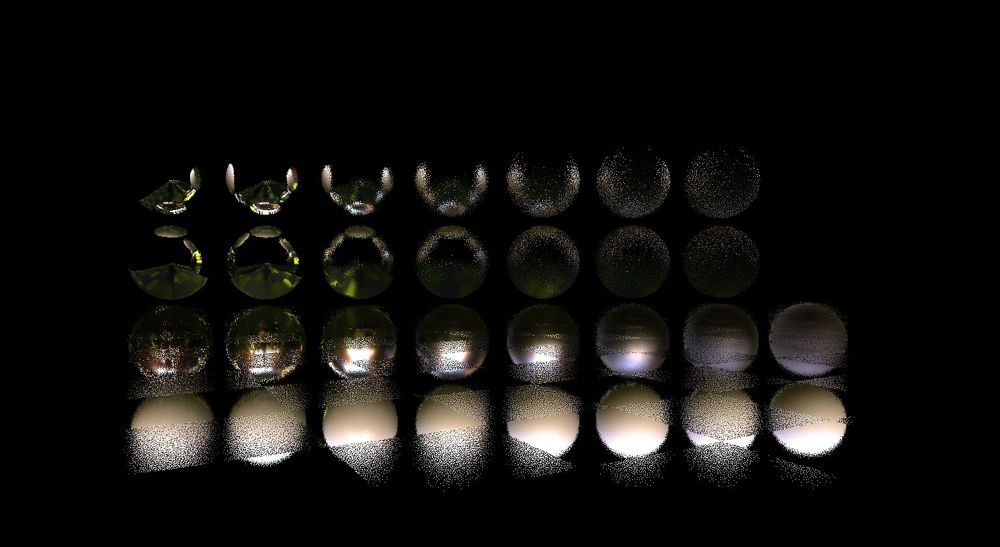
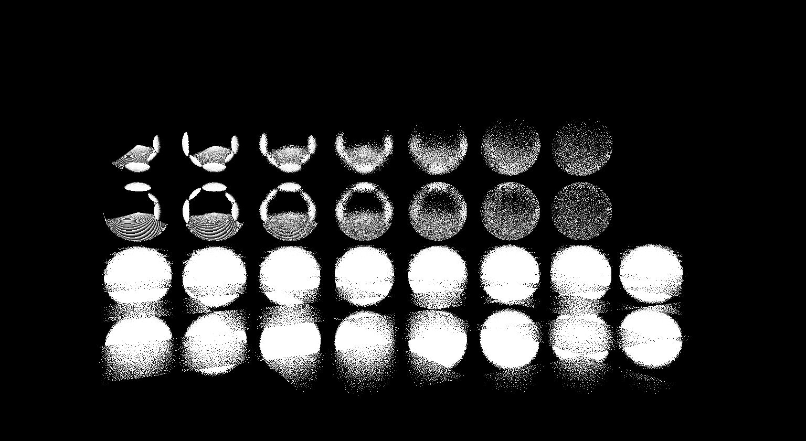
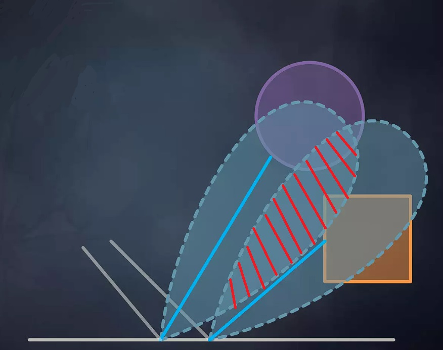
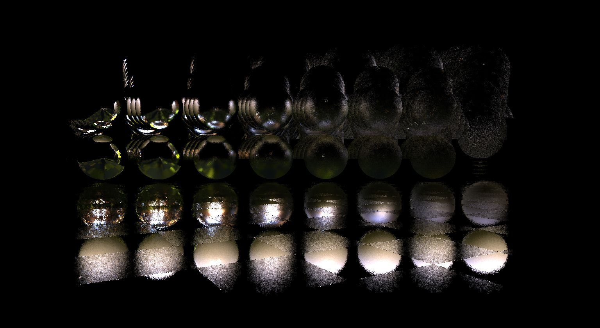
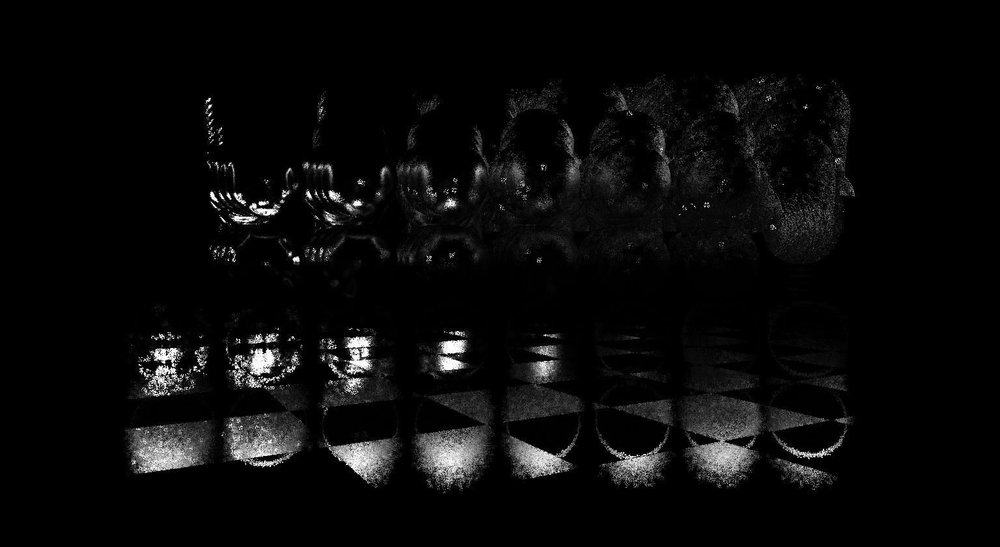
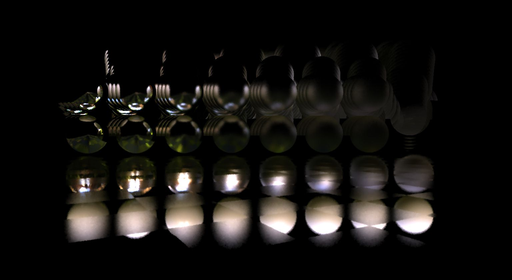
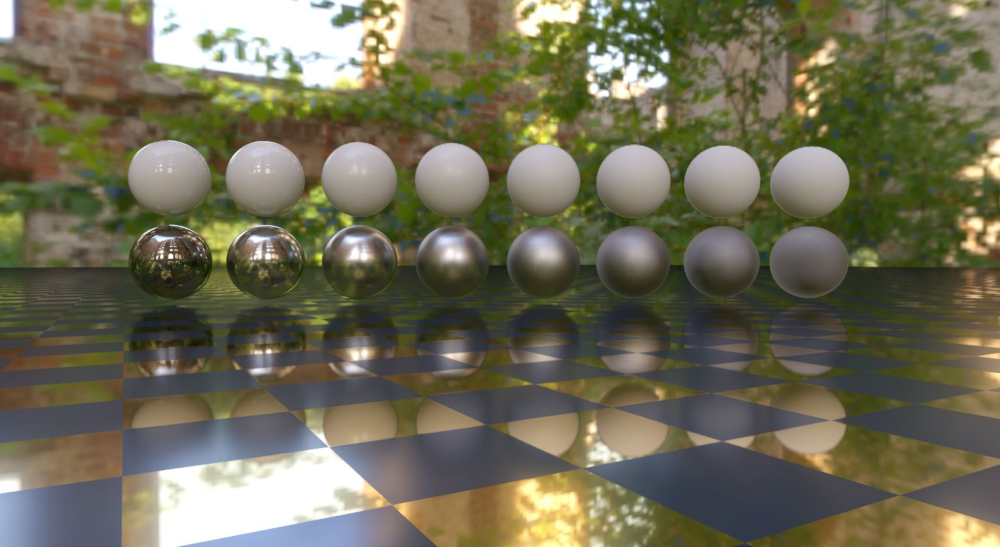

# Screen Space Reflections


## Table of contents
- [Introduction](#introduction)
    - [Motivation](#motivation)
    - [Supported platforms](#supported-platforms)
	
- [Integration guidelines](#integration-guidelines)
    - [Input resources](#input-resources)
    - [Host API](#host-api)
- [Implementation details](#implementation-details)
    - [Algorithm structure](#algorithm-structure)
    - [Preparation for ray tracing](#preparation-for-ray-tracing)
        - [Blue noise texture generation](#blue-noise-texture-generation)
        - [Hierarchical depth generation](#hierarchical-depth-generation)
        - [Stencil mask generation and roughness extraction](#stencil-mask-generation-and-roughness-exraction)
    - [Ray tracing](#ray-tracing)
    - [Denoising](#denoising)
	    - [Spatial reconstruction](#spatial-reconsturction)
	    - [Temporal accumulation](#temporal-accumulation)
	    - [Cross-bilateral filtering](#cross-bilateral-filtering)
- [Possible improvements](#possible-improvements)
- [References](#references)


## Introduction 

### Motivation

We needed to add screen space reflections to our project with the following requirements:
- Compatibility with WebGL
- Rough surfaces support
- The execution time should not exceed 2ms at Full HD resolution on devices equivalent to RTX 2070.

 We used AMD's implementation of Screen Space Reflections as the basis for our implementation
 [**[AMD-SSSR]**](https://gpuopen.com/manuals/fidelityfx_sdk/fidelityfx_sdk-page_techniques_stochastic-screen-space-reflections/).
 We recommend reading AMD's documentation and also a more detailed review of the algorithm by Kostas Anagnostou
 [**[Kostas Anagnostou, SSSR]**](https://interplayoflight.wordpress.com/2022/09/28/notes-on-screenspace-reflections-with-fidelityfx-sssr/)
 to better understand the following sections.
 Since WebGL doesn't support compute shaders, we had to make some compromises for compatibility.
 Please refer to [implementation details](#implementation-details) section for further insights.
	

## Integration guidelines

### Input resources

The following table enumerates all external inputs required by SSR.

| **Input Textures**      |
| ----------------------- |

| **Name**            			    |  **Format**                        | **Notes**                                           |  
| --------------------------------- |------------------------------------|---------------------------------------------------- |
| Color buffer    					| `APPLICATION SPECIFIED`            | The HDR render target of the current frame containing the scene radiance |
| Depth buffer    					| `APPLICATION SPECIFIED (1x FLOAT)` | The depth buffer for the current frame provided by the application. The data should be provided as a single floating point value, the precision of which is under the application's control |
| Normal buffer   					| `APPLICATION SPECIFIED (3x FLOAT)` | The normal buffer for the current frame provided by the application in the [-1.0, +1.0] range. Normals should be in world space |
| Material parameters buffer        | `APPLICATION SPECIFIED (1x FLOAT)` | The roughness buffer for the current frame provided by the application. By default, SSR expects the roughness to be the perceptual / artist set roughness **squared**. If your GBuffer stores the artist set roughness directly, please set the `IsRoughnessPerceptual` field of the `ScreenSpaceReflectionAttribs` structure to `true`. The user is also expected to provide a channel to sample from the material parameters buffer through the `RoughnessChannel` field of the `ScreenSpaceReflectionAttribs` structure. |
| Motion vectors  					| `APPLICATION SPECIFIED (2x FLOAT)` | The 2D motion vectors for the current frame provided by the application in the NDC space |


| **HLSL::ScreenSpaceReflectionAttribs**  |
| --------------------------------------- |

| **Name**                                 | **Notes** |
| -----------------------------------------|-----------|
| Depth buffer thickness                   | A bias for accepting hits. Larger values can cause streaks, lower values can cause holes |
| Roughness threshold                      | Regions with a roughness value greater than this threshold won't spawn rays |
| Most detailed mip                        | The most detailed MIP map level in the depth hierarchy. Perfect mirrors always use 0 as the most detailed level |
| Roughness perceptual                     | A boolean to describe the space used to store roughness in the materialParameters texture. If false, we assume roughness squared was stored in the G-Buffer |
| Roughness channel                        | The channel to read the roughness from the materialParameters texture |
| Max traversal intersections              | Caps the maximum number of lookups that are performed from the depth buffer hierarchy. Most rays should terminate after approximately 20 lookups |
| Importance sample bias                   | This parameter is aimed at reducing noise by modify sampling in the [ray tracing stage](#ray-tracing). Increasing the value increases the deviation from the ground truth but reduces the noise  |
| Spatial reconstruction radius            | The value controls the kernel size in the [spatial reconstruction step](#spatial-reconsturction). Increasing the value increases the deviation from the ground truth but reduces the noise |
| Temporal radiance stability factor       | A factor to control the accmulation of history values of radiance buffer. Higher values reduce noise, but are more likely to exhibit ghosting artefacts  |
| Temporal variance stability factor       | A factor to control the accmulation of history values of variance buffer. Higher values reduce noise, but are more likely to exhibit ghosting artefacts         |
| Bilateral cleanup spatial sigma factor   | This parameter represents the standard deviation ($\sigma$) in the Gaussian kernel, which forms the spatial component of the [bilateral filter](#cross-bilateral-filtering) |

The effect can be configured using the `ScreenSpaceReflection::FEATURE_FLAGS` enumeration. The following table lists the flags and their descriptions.

| **Name**                                 | **Notes** |
| -----------------------------------------|-----------|
| `FEATURE_FLAG_PREVIOUS_FRAME`            |  When using this flag, you only need to pass the color buffer of the previous frame. We find the intersection using the depth buffer of the current frame, and when an intersection is found, we make the corresponding offset by the velocity vector at the intersection point, for sampling from the color buffer. |
| `FEATURE_FLAG_HALF_RESOLUTION`           | When this flag is used, ray tracing step is executed at half resolution |

### Host API

To integrate SSR into your project, you need to include the following necessary header files:
```cpp
#include "PostFXContext.hpp"
#include "ScreenSpaceReflection.hpp"
```
```cpp
namespace HLSL
{
#include "Shaders/Common/public/BasicStructures.fxh"
#include "Shaders/PostProcess/ScreenSpaceReflection/public/ScreenSpaceReflectionStructures.fxh"
} // namespace HLSL
```

Now, create the necessary objects:
```cpp
m_PostFXContext = std::make_unique<PostFXContext>(m_pDevice);
m_SSR           = std::make_unique<ScreenSpaceReflection>(m_pDevice);
```

Next, call the methods to prepare resources for the `PostFXContext` and `ScreenSpaceReflection` objects.
This needs to be done every frame before starting the rendering process.
```cpp
{
    PostFXContext::FrameDesc FrameDesc;
    FrameDesc.Index  = m_CurrentFrameNumber; // Current frame number.
    FrameDesc.Width  = SCDesc.Width;         // Current screen width.
    FrameDesc.Height = SCDesc.Height;        // Current screen height.
    m_PostFXContext->PrepareResources(m_pDevice, FrameDesc, PostFXContext::FEATURE_FLAG_NONE);

    ScreenSpaceReflection::FEATURE_FLAGS ActiveFeatures = ...;
    m_SSR->PrepareResources(m_pDevice, m_pImmediateContext, m_PostFXContext.get(), ActiveFeatures);
}
```

Now we invoke the method `PostFXContext::Execute`. At this stage, some intermediate resources necessary for all post-processing objects
dependent on `PostFXContext` are calculated. This method can take a constant buffer directly containing an array from the current and previous
cameras (for this method, you can refer to this section of the code  [[0](https://github.com/DiligentGraphics/DiligentSamples/blob/380b0a05b6c72d80fd6d574d7343ead77d6dd7eb/Tutorials/Tutorial27_PostProcessing/src/Tutorial27_PostProcessing.cpp#L164)] and [[1](https://github.com/DiligentGraphics/DiligentSamples/blob/380b0a05b6c72d80fd6d574d7343ead77d6dd7eb/Tutorials/Tutorial27_PostProcessing/src/Tutorial27_PostProcessing.cpp#L228)]).
Alternatively, you can pass the corresponding pointers `const HLSL::CameraAttribs* pCurrCamera` and `const HLSL::CameraAttribs* pPrevCamera` for the current
and previous cameras, respectively. You also need to pass the depth of the current and previous frames (the depth buffers should not contain transparent objects), and a buffer with motion vectors in NDC space, into the corresponding `ITextureView* pCurrDepthBufferSRV`, `ITextureView* pPrevDepthBufferSRV`, `ITextureView* pMotionVectorsSRV` pointers.

```cpp
{
    PostFXContext::RenderAttributes PostFXAttibs;
    PostFXAttibs.pDevice             = m_pDevice;
    PostFXAttibs.pDeviceContext      = m_pImmediateContext;
    PostFXAttibs.pCameraAttribsCB    = m_FrameAttribsCB;  // m_Resources[RESOURCE_IDENTIFIER_CAMERA_CONSTANT_BUFFER].AsBuffer();
    PostFXAttibs.pCurrDepthBufferSRV = m_CurrDepthBuffer; // m_Resources[RESOURCE_IDENTIFIER_DEPTH0 + CurrFrameIdx].GetTextureSRV();
    PostFXAttibs.pPrevDepthBufferSRV = m_PrevDepthBuffer; // m_Resources[RESOURCE_IDENTIFIER_DEPTH0 + PrevFrameIdx].GetTextureSRV();
    PostFXAttibs.pMotionVectorsSRV   = m_MotionBuffer;    // m_GBuffer->GetBuffer(GBUFFER_RT_MOTION_VECTORS)->GetDefaultView(TEXTURE_VIEW_SHADER_RESOURCE);
    m_PostFXContext->Execute(PostFXAttibs);
}
```

Now we need to directly invoke the ray tracing stage. To do this, we call the `ScreenSpaceReflection::Execute` method. Before this, we need to fill the passed structures `ScreenSpaceReflectionAttribs` and `ScreenSpaceReflection::RenderAttributes` with the necessary data. Please read the [Input resources section](#input-resources) for a more detailed description of each parameter
```cpp
{
    HLSL::ScreenSpaceReflectionAttribs SSRAttribs{};
    SSRAttribs.RoughnessChannel      = 0;
    SSRAttribs.IsRoughnessPerceptual = true;

    ScreenSpaceReflection::RenderAttributes SSRRenderAttribs{};
    SSRRenderAttribs.pDevice            = m_pDevice;
    SSRRenderAttribs.pDeviceContext     = m_pImmediateContext;
    SSRRenderAttribs.pPostFXContext     = m_PostFXContext.get();
    SSRRenderAttribs.pColorBufferSRV    = m_GBuffer->GetBuffer(GBUFFER_RT_RADIANCE)->GetDefaultView(TEXTURE_VIEW_SHADER_RESOURCE);
    SSRRenderAttribs.pDepthBufferSRV    = m_GBuffer->GetBuffer(GBUFFER_RT_DEPTH)->GetDefaultView(TEXTURE_VIEW_DEPTH_STENCIL);
    SSRRenderAttribs.pNormalBufferSRV   = m_GBuffer->GetBuffer(GBUFFER_RT_NORMAL)->GetDefaultView(TEXTURE_VIEW_SHADER_RESOURCE);
    SSRRenderAttribs.pMaterialBufferSRV = m_GBuffer->GetBuffer(GBUFFER_RT_MATERIAL_DATA)->GetDefaultView(TEXTURE_VIEW_SHADER_RESOURCE);
    SSRRenderAttribs.pMotionVectorsSRV  = m_GBuffer->GetBuffer(GBUFFER_RT_MOTION_VECTORS)->GetDefaultView(TEXTURE_VIEW_SHADER_RESOURCE);
    SSRRenderAttribs.pSSRAttribs        = &SSRAttribs;
    m_SSR->Execute(SSRRenderAttribs);
}

```

Now, you can directly obtain a `ITextureView` on the texture containing the SSR result using the method `ScreenSpaceReflection::GetSSRRadianceSRV`.
After this, you can apply SSR in your rendering pipeline using the formula below. 

```math
\large \text{SpecularRadiance} = \sum_{i=1}^{n} (F_0 * LUT_{BRDF}.x + LUT_{BRDF}.y) \times \text{lerp}(\text{Environment}_i, \text{SSR}, \text{Confidence})
```
The alpha channel of the SSR texture stores $Confidence$. You can read about how to compute the $LUT_{BRDF}$ in this article
[**[Brian Karis, PBR]**](https://cdn2.unrealengine.com/Resources/files/2013SiggraphPresentationsNotes-26915738.pdf) page 7.
The parameter $F_0$ is the Fresnel coefficient.


## Implementation details

### Algorithm structure

The algorithm can be divided into three main parts
 1. [Preparation for ray tracing](#preparation-for-ray-tracing)
	- [Blue noise texture generation](#blue-noise-texture-generation)
	- [Hierarchical depth generation](#hierarchical-depth-generation)
	- [Stencil mask generation and roughness extraction](#stencil-mask-generation-and-roughness-exraction)
 2. [Ray Tracing](#ray-tracing)
 3. [Denoising](#denoising)
	- [Spatial reconstruction](#spatial-reconsturction)
	- [Temporal accumulation](#temporal-accumulation)
	- [Cross-bilateral filtering](#cross-bilateral-filtering)


### Preparation for ray tracing

In this stage, we prepare the necessary resources for the ray tracing stage


#### Blue noise texture generation

Blue noise aims to uniformly distribute sample points across the sampling domain. This is in direct contrast to white noise, which exhibits
clumps and voids. Clumped samples result in redundant data, while voids represent missing data. Blue noise circumvents these issues by
maintaining a roughly uniform distribution in space, thus avoiding clumps and voids.

| Comparison of sampling with white noise and blue noise         |
|:--------------------------------------------------------------:|  
|   						         |

AMD's implementation prepares a 128×128 texture with screen-space (animated) blue noise
([PrepareBlueNoiseTexture](https://github.com/GPUOpen-LibrariesAndSDKs/FidelityFX-SDK/blob/main/sdk/include/FidelityFX/gpu/sssr/ffx_sssr_prepare_blue_noise_texture.h)),
based on the work of Eric [**[Eric Heitz, Blue Noise]**]( https://eheitzresearch.wordpress.com/762-2/). This will be used later to drive the stochastic sampling of 
the specular lobe. 

In general, we follow the AMD's approach, with the exception that we generate two blue noise textures simultaneously and use a pixel shader
[**ComputeBlueNoiseTexture.fx**](https://github.com/DiligentGraphics/DiligentFX/blob/master/Shaders/Common/private/ComputeBlueNoiseTexture.fx) instead
of a compute shader. The second blue noise texture is required for SSAO, as our goal is to prevent potential correlation between pixels obtained in the
SSR and SSAO steps. AMD uses `uint32_t` format to store static arrays such as `SobolBuffer` (256 * 256 * 4 bytes = 256 KiB) and 
`ScramblingTileBuffer` (128 * 128 * 4 * 8 bytes = 512 KiB), which respectively adds 768 KiB to the executable file. We changed format of the static arrays
from `uint32_t` to `uint8_t`, and also noticed that `SobolBuffer` is used only along one dimension. Consequently, we have reduced the added size to the
executable file to 128 KiB by making these optimizations.


#### Hierarchical depth generation

The hierarchical depth buffer is a mip chain where each pixel is the minimum (maximum for reserved depth) of the previous level's 2×2
area depths (mip 0 corresponds to the screen-sized, original depth buffer). It will be used later to speed up raymarching, but can also be used in many
other techniques, like GPU occlusion culling.

| Depth mip chain                     |
|:-----------------------------------:|
| |

We recommend reading this article [**[Mike Turitzin, Hi-Z]**](https://miketuritzin.com/post/hierarchical-depth-buffers/), as computing a
hierarchical buffer for resolutions not divisible by 2 is not so trivial. The original AMD algorithm uses SPD
[**[AMD-SPD]**](https://gpuopen.com/manuals/fidelityfx_sdk/fidelityfx_sdk-page_techniques_single-pass-downsampler/) to convolve the depth buffer
([DepthDownsample](https://github.com/GPUOpen-LibrariesAndSDKs/FidelityFX-SDK/blob/main/sdk/include/FidelityFX/gpu/sssr/ffx_sssr_depth_downsample.h)).
SPD allows us to compute it in a single **Dispatch** call, but since we can't use compute shaders we use a straightforward approach.
We calculate each mip level using a pixel shader [**SSR_ComputeHierarchicalDepthBuffer.fx**](https://github.com/DiligentGraphics/DiligentFX/blob/master/Shaders/PostProcess/ScreenSpaceReflection/private/SSR_ComputeHierarchicalDepthBuffer.fx), using the previous mip level as an input.


#### Stencil mask generation and roughness extraction

The original algorithm starts with a classification pass ([**ClassifyTiles**](https://github.com/GPUOpen-LibrariesAndSDKs/FidelityFX-SDK/blob/main/sdk/include/FidelityFX/gpu/sssr/ffx_sssr_classify_tiles.h)).
This step writes pixels that will participate in the [ray tracing step](#ray-tracing) and subsequent [denoising stages](#denoising) to a global buffer
(our denoiser differs from the AMD's implementation, but the underlying idea remains the same).
The decision of whether a pixel needs a ray or not is based on the roughness; very rough surfaces don't get any rays and instead rely on the prefiltered
environment map as an approximation. 
Once this done we are (almost) ready to ray march, the only problem is that we don’t know the size of the global array of pixels to trace on the CPU 
to launch a `Dispatch`. For that reason, the technique fills a buffer with indirect arguments, with data already known to the GPU and uses a
`DispatchIndirect` instead. The indirect arguments buffer is populated during the
[**PrepareIndirectArgs**](https://github.com/GPUOpen-LibrariesAndSDKs/FidelityFX-SDK/blob/main/sdk/include/FidelityFX/gpu/sssr/ffx_sssr_prepare_indirect_args.h)
pass. Nothing particular to mention here apart from that it adds 2 entries to the indirect buffer, one for the pixels to trace and one for the tiles to denoise later.

Since we cannot use compute shaders, we have made compromises. We use a stencil mask to mark pixels that should participate in subsequent calculations.
To do this, we first clear stencil buffer with `0x0` value, and then we run
[**SSR_ComputeStencilMaskAndExtractRoughness.fx**](https://github.com/DiligentGraphics/DiligentFX/blob/master/Shaders/PostProcess/ScreenSpaceReflection/private/SSR_ComputeStencilMaskAndExtractRoughness.fx)
with stencil test enabled for writing and with the corresponding stencil buffer attached. If the roughness of the current pixel is less than `RoughnessThreshold`,
we write the value `0xFF` to the stencil buffer; otherwise, the stencil buffer retains its previous value of `0x0`. In subsequent steps, we enable stencil test
for reading with the `COMPARISON_FUNC_EQUAL` function for the value `0xFF`. While writing to the stencil buffer, we also write the roughness to a separate
render target. The separate texture allows us to simplify the code for roughness sampling in subsequent steps of the algorithm and improves performance.

| Stencil mask for SSR        | Final renderend image with SSR |
|:---------------------------:|:------------------------------:|
| |    |


### Ray tracing
We have now reached the most crucial part of the algorithm, for which all the previous preparations were made. We almost entirely repeat the ([**Intersect**](https://github.com/GPUOpen-LibrariesAndSDKs/FidelityFX-SDK/blob/main/sdk/include/FidelityFX/gpu/sssr/ffx_sssr_intersect.h)) step with some exceptions; refer to the difference section.

Our goal is to solve the rendering equation for the specular part (GGX Microfacet BRDF)

<div align="center">
<b>Specular part of rendering equation</b>
</div>

$$
\large L_{o,s}(\mathbf{v}) = \int_{\Omega} \frac{F(\mathbf{v,h})D(\mathbf{h})G(\mathbf{l,v})}{4 \langle \mathbf{n} \cdot \mathbf{l} \rangle \langle \mathbf{n} \cdot \mathbf{v} \rangle} L_i(\mathbf{l}) \cos(\theta) d\omega
$$

Unfortunately, it is impossible to calculate the rendering equation accurately in real-time, so AMD's SSSR uses Split-Sum-Approximation.
We strongly recommend reading the original article by
[**[Brian Karis, PBR]**](https://cdn2.unrealengine.com/Resources/files/2013SiggraphPresentationsNotes-26915738.pdf), as well as viewing this
presentation [**[Thorsten Thormählen, IBL]**](https://www.mathematik.uni-marburg.de/~thormae/lectures/graphics1/graphics_10_2_eng_web.html#1)
starting from slide 29, if you are interested in the derivation of the resulting formula

<div align="center">
<b>Split-Sum-Approximation </b>
</div>

$$
\begin{gather}
\large \frac{1}{N} \sum_{n=1}^{N} \frac{F(\mathbf{v}, \mathbf{h}) G(\mathbf{l}, \mathbf{v}) \langle \mathbf{v} \cdot \mathbf{h} \rangle}{\langle \mathbf{n} \cdot \mathbf{h} \rangle \langle \mathbf{n} \cdot \mathbf{v} \rangle} L_i(\mathbf{l}) \approx \underbrace{\frac{1}{N} \sum_{n=1}^{N} L_i(\mathbf{l})}\_{T_1} \cdot \underbrace{\frac{1}{N} \sum_{n=1}^{N} \frac{F(\mathbf{v}, \mathbf{h}) G(\mathbf{l}, \mathbf{v}) \langle \mathbf{v} \cdot \mathbf{h} \rangle}{\langle \mathbf{n} \cdot \mathbf{h} \rangle \langle \mathbf{n} \cdot \mathbf{v} \rangle}}\_{T_2} \\
\large \text{with } \mathbf{h} = \begin{pmatrix}
\sin(\theta_h)\cos(\phi_h) \\
\sin(\theta_h)\sin(\phi_h) \\
\large \cos(\theta_h)
\end{pmatrix}
\text{ and } \mathbf{l} = \text{reflect}(-\mathbf{v}, \mathbf{h}) \\
\large \text{where } \phi_h = 2\pi \chi_x(n) \text{ and } \theta_h = \arccos\left(\frac{1 - \chi_y(n)}{\sqrt{\chi_y(n)(\alpha^2-1)+1}}\right)
\end{gather}
$$

In the expression shown in the image above, we see two sums, $T_{1}$ and $T_{2}$. Let's first consider the sum $T_{2}$.
In the original article by Epic Games, the $T_{2}$ sum is divided into two separate sums, $T_{2,r}$ and $T_{2,g}$ (see below),
by inserting the Schlick approximation for $F$:

<div align="center">
<b>Split-Sum for BRDF Integration Map </b>
</div>

$$
\begin{align}
&\large T_2 = \frac{1}{N} \sum_{n=1}^{N} \frac{F(\mathbf{v}, \mathbf{h}) G(\mathbf{l}, \mathbf{v}) \langle \mathbf{v} \cdot \mathbf{h} \rangle}{\langle \mathbf{n} \cdot \mathbf{h} \rangle \langle \mathbf{n} \cdot \mathbf{v} \rangle} \\
&\large = F_0 \underbrace{\frac{1}{N} \sum_{n=1}^{N} \frac{G(\mathbf{l}, \mathbf{v}) \langle \mathbf{v} \cdot \mathbf{h} \rangle}{\langle \mathbf{n} \cdot \mathbf{h} \rangle \langle \mathbf{n} \cdot \mathbf{v} \rangle} \left( 1.0 - (1.0 - \langle \mathbf{v} \cdot \mathbf{h}\rangle )^5 \right)}\_{T_{2,r}} \\
&\large + \underbrace{\frac{1}{N} \sum_{n=1}^{N} \frac{G(\mathbf{l}, \mathbf{v}) \langle \mathbf{v} \cdot \mathbf{h} \rangle}{\langle \mathbf{n} \cdot \mathbf{h} \rangle \langle \mathbf{n} \cdot \mathbf{v} \rangle} (1.0 - \langle \mathbf{v} \cdot \mathbf{h} \rangle^5) }\_{T_{2,g}}
\end{align}
$$

The result of the pre-computation $T_{2,r}$ and $T_{2,g}$ can be stored in the red and green channel of a LUT texture,
which is parameterized in x-direction by $⟨n⋅v⟩$ an in y-direction by the roughness $r_{p}$ (both in the range [0.0, 1.0]).
Here you can take a look at the source code for computing this texture
([PrecomputeBRDF.psh](https://github.com/DiligentGraphics/DiligentFX/blob/master/Shaders/PBR/private/PrecomputeBRDF.psh)),
known as a BRDF Integration Map. The original sum $T_{2}$ is obtained using Fresnel coefficient $F_{0}$. Since our algorithm
does not require surface information, the calculation of the $T_{2}$ sum must be carried out on the user's side.

Let's now turn to the sum $T_{1}$. In the article by Epic Games, it is calculated for the Environment Map, taking into account roughness,
and they call this the Pre-Filtered Environment Map. In our case, we need to calculate the $T_{1}$ sum for each pixel explicitly. Since the
ray tracing step is expensive, we compute only one sample incoming radiace $L_i(\mathbf{l})$ per pixel, and the accumulation of the
sum $T_1$ is performed in the [temporal accumulation step](#temporal-accumulation), using spatial reprojection. For computing of incoming
radiance $L_i(\mathbf{l})$, we must generate a half-vector $\mathbf{h}$ for every pixel, then use it to derive the light vector
$\mathbf{l} = \text{reflect}(-\mathbf{v},\mathbf{h})$. Now we need to find the intersection of the ray based on the world-space position
of the pixel and the generated light vector $\mathbf{l}$, with the scene using hierarchical ray marching. If an intersection occurs,
we should take the corresponding radiance value from the `ColorBuffer`; otherwise, we take the value from the EnvironmentMap
(our algorithm does not require an Environment Map as in the AMD implementation, we use `Confidence` color channel for resolve radiance;
refer to the difference section).

An attentive reader has likely noticed $\chi_x$ and $\chi_y$ in the Split-Sum-Approximation equation for generating the half-vector
$\mathbf{h}$. These are precisely the values from the animated blue noise texture that we generated [before](#blue-noise-texture-generation).
Using the blue noise texture, we accordingly generate the half vector. The method just described has a significant drawback; please refer to the image below.

| Invalid ray                             |
|:---------------------------------------:|
|            |

As seen in the image above, the previously proposed method for creating samples to calculate incoming radiance generates rays that
are below the horizon. To solve this problem, we use the method [**[Eric Heitz, VNDF]**](http://jcgt.org/published/0007/04/01/) for generating
half-vector $\mathbf{h}$. This method suggests creating the half-vector in such a way where $\mathbf{v} = (v_x, v_y, v_z)$:

```math
\begin{align*}
    &\large \mathbf{v}_h = \frac{1}{\sqrt{\alpha^2 v_x^2 + \alpha^2 v_y^2 + v_z^2}} \begin{pmatrix} \alpha v_x \\ \alpha v_y \\ v_z \end{pmatrix} \\
    &\large l = v_{h, x}^2 + v_{h, y}^2 \\
    &\large \mathbf{T}_1 = \begin{cases} 
        \frac{1}{\sqrt{l}} \begin{pmatrix} -v_{h,y} \\ v_{h, x} \\ 0 \end{pmatrix}, & \text{if } l > 0 \\
        \begin{pmatrix} 1 \\ 0 \\ 0 \end{pmatrix}, & \text{otherwise}
    \end{cases} \\
    &\large \mathbf{T}_2 = \mathbf{v}_h \times \mathbf{T}_1 \\
    &\large r = \sqrt{\chi_x(n)} \\
    &\large \phi = 2 \pi \chi_y(n) \\
    &\large t_1 = r \cos(\phi) \\
    &\large t_2 = (1 - 0.5(1 + v_{h.z}))\sqrt{1 - t_1^2} + 0.5(1 + v_{h,z}) r \sin(\phi) \\
    &\large \mathbf{h}_h = t_1 \mathbf{T}_1 + t_2 \mathbf{T}_2 + \sqrt{\max(0, 1 - t_1^2 - t_2^2)} \mathbf{v}_h \\
    &\large \mathbf{h} = \frac{1}{\sqrt{\alpha^2 h_{h, x}^2 + \alpha^2 h_{h, y}^2 + \max(0, h_{h, z}^2)}} \begin{pmatrix} \alpha h_{h,x} \\ \alpha h_{h,y} \\ \max(0, h_{h,z}) \end{pmatrix}
\end{align*}
```

Let's directly move on to the stage of hierarchical ray marching. This method allows us to efficiently skip empty areas.
Raymarching starts at mip 0 (highest resolution) of the depth buffer. If no collision is detected, we drop to a lower resolution
mip and continue raymarching. Again, if no collision is detected we continue dropping to lower resolution mips until we detect one.
If we do, we climb back up to a higher resolution mip and continue from there. This allows quickly skipping empty space in the depth buffer.
If you're unclear about how hierarchical ray marching works, take a look at the animated slides below.

|  Hierarchical depth buffer traversal     |
|:----------------------------------------:|
| |

After finding the intersection point of the ray with the scene, we calculate the screen coordinate and sample incoming radiance from
`ColorBuffer` and write it as the result for the current pixel (the original implementation samples from the Environment Map if no intersection occurs;
in our implementation, this is not the case). Also, we record the length of the ray, which will be needed during the denoising stages. You can view the
code implementing this step here:
[**SSR_ComputeIntersection.fx**](https://github.com/DiligentGraphics/DiligentFX/blob/master/Shaders/PostProcess/ScreenSpaceReflection/private/SSR_ComputeIntersection.fx).

Key differences with the AMD implementation in the ray tracing step:
* Since the scene may contain multiple environment maps, each of which may interact with a different pixel, we decided not to pass the environment map to the SSR stage (although this means we lose grazing specular reflections in areas where ray does not intersect with scene). Instead, we write a confidence value (roughly speaking, `1` if an intersection occurred, `0` if not) in the alpha channel of the resulting texture. This value will later be used by the user to interpolate between the value from the SSR and the Environment Map.
* Since we do not use AMD's denoiser but our own, we needed to record the result $p$ - PDF of the generated half vector $\mathbf{h}$ and light vector $\mathbf{l}$. Read section [spatial reconstruction](#spatial-reconstruction)
* We added GGX Bias parameter that allows us to reduce the variance a bit. We recommend you watching this video to understand how it works
[**[EA-SSRR]**](https://youtu.be/AzXEao-WKRc?t=1122)

|     Specular radiance after ray tracing            |         Confidence          |
|:--------------------------------------------------:|:---------------------------:|
|                     ||


### Denoising

As we can see, the image obtained from the ray tracing step is quite noisy. The goal of the next stage of the algorithm is to reduce that noise.


#### Spatial reconstruction

At this step of the denoising algorithm, we make the assumption that closely located surface points have the same visibility,
so we attempt to accumulate the incoming radiance of each point from its nearby points.

| Same visibility in the red zone     |
|:-----------------------------------:|
|        |

This assumption introduces bias into the final image, but despite this drawback, it significantly reduces noise on surfaces with high roughness.
To accumulate samples, we use an approach from [**[EA-SSRR]**](https://youtu.be/AzXEao-WKRc?t=746).They suggest using this formula to accumulate samples:

```math
\Large L_{o, s}(\mathbf{v}) \approx \frac{\sum_{n=1}^{N} \frac{L_i(\mathbf{l}) f_r(\mathbf{v}, \mathbf{l}) \langle \mathbf{n} \cdot \mathbf{l} \rangle}{p_n}}{\sum_{n=1}^{N} \frac{f_r( \mathbf{v}, \mathbf{l}) \langle \mathbf{n} \cdot \mathbf{l} \rangle}{p_n}} T_2
```

As can be noted, to calculate the sums in front of the $T_2$, we already have all the necessary components $L_i$, $l$, $p$, as we have mentioned in the ray tracing step.
You can view the source code for the computation of this stage:
[**SSR_ComputeSpatialReconstruction.fx**](https://github.com/DiligentGraphics/DiligentFX/blob/master/Shaders/PostProcess/ScreenSpaceReflection/private/SSR_ComputeSpatialReconstruction.fx)
It can be noted that we accumulate samples in screen space, and we also use a variable radius and a variable number of samples depending on the surface roughness when computing this expression.
Also, during the sum accumulation, we calculate the variance and search for the maximum ray length (from ray tracing stage, we pass non-normalized ray with length (`SurfaceHitWS` - `RayOriginWS`)),
and then we record the results in separate textures. The variance will be needed for cross-bilateral filtering pass. The ray length will be required during the temporal accumulation stage for
parallax correction.

| Specular radiance after spatial reconstruction  | Variance            |
|:----------------------------------------:|:--------------------------:|
| | |


#### Temporal accumulation

At this step, we accumulate the image obtained after the spatial reconstruction with the image obtained at this step but from a previous moment in time.
We rely on the temporal coherence of frames, as the information between frames does not change significantly. One might wonder why we don't
simply use the TAA (Temporal Anti-Aliasing) algorithm. A typical reprojection method, commonly employed in TAA, is not adequately effective for reflections.
This is because the objects reflected move according to their own depth, rather than the depth of the surfaces reflecting them, which is what's recorded in
the depth buffer. Therefore, we need to ascertain the previous frame's location of these reflected objects. Overall, our implementation of temporal accumulation
is similar to the implementation by AMD [Reproject](https://github.com/GPUOpen-LibrariesAndSDKs/FidelityFX-SDK/blob/main/sdk/include/FidelityFX/gpu/denoiser/ffx_denoiser_reflections_reproject.h).

We use the approach from this presentation [**[EA-HYRTR]**](https://www.ea.com/seed/news/seed-dd18-presentation-slides-raytracing), slide 45. 
At a high level, we can divide the current stage into four parts:
1) Calculate the statistics of the current pixel (mean, standard deviation, variance) based on color buffer.
2) Compute intensity from the previous frame for two screen space points relative to the current pixel's position. The first position is formed by subtracting the motion vector from the current pixel's position, while the second position is calculated based on the ray length, which we computed during the ray tracing stage and modified during the spatial reprojection stage.
3) Based on the statistics of the current pixel and the intensity values for two points, we select the point on which we will base the reprojection.
4) If the reprojection is successful, we interpolate the values between the intensity from the selected point (which we calculated in the previous step) and the intensity value for the current pixel. If the reprojection is not successful, we record the intensity value from the current pixel.

For implementation details, look at the source code: [**SSR_ComputeTemporalAccumulation.fx**](https://github.com/DiligentGraphics/DiligentFX/blob/master/Shaders/PostProcess/ScreenSpaceReflection/private/SSR_ComputeTemporalAccumulation.fx).

|Specular radiance after temporal accumulation|
|:-------------------------------------------:|
|     |


#### Cross-bilateral filtering

This stage is based on a standard bilateral filter [**[Wiki, Bilateral filter]**]( https://en.wikipedia.org/wiki/Bilateral_filter) with the following specifics:
* We use variance calculated during the spatial reconstruction stage to determine the $\sigma$ for the spatial kernel $G_s$ of the bilateral filter.
* Since the image being processed is quite noisy, instead of using the pixel intensity of the processed image to create the range kernel $G_r$, we use the depth buffer and the normals buffer to form the kernel. We took the functions for generate the range kernel $G_r$ from the SVGF algorithm [**[Christoph Schied, SVGF]**](https://cg.ivd.kit.edu/publications/2017/svgf/svgf_preprint.pdf), expressions $(3)$ and $(4)$

You can find the implementation here: [**SSR_ComputeBilateralCleanup.fx**](https://github.com/DiligentGraphics/DiligentFX/blob/master/Shaders/PostProcess/ScreenSpaceReflection/private/SSR_ComputeBilateralCleanup.fx)


|Specular radiance after bilater filtering |  
|:----------------------------------------:|
|       |

The final frame with reflections is shown below.

|Final image after tone mapping            |  
|:----------------------------------------:|
|                 |


## Possible improvements

* Add support for reversed depth buffer
* Add support for compressed normal map
* Add dynamic resolution for the raytracing stage, which will increase performance on weaker GPU
* [Spatial reconstruction step](#spatial-reconsturction) uses screen space to accumulate samples. Try to perform accumulation in world coords, this should reduce bias
* We can also try calculating direct specular occlussion in the [ray tracing step](#ray-tracing)
* The bilateral filter does not have separability property, so it will have poor performance on large kernel dimensions. Consider replacing it by [Guided Image Filtering](https://kaiminghe.github.io/eccv10/index.html) since this algorithm has this property
* Current implementation of hierarchical ray marching has a [problem](https://youtu.be/MlTohmB4Gh4?t=762). We have to try to fix it
 
## References

- **[AMD-SSSR]**: FidelityFX Stochastic Screen-Space Reflections 1.4 - https://gpuopen.com/manuals/fidelityfx_sdk/fidelityfx_sdk-page_techniques_stochastic-screen-space-reflections/
- **[AMD-SPD]**:  FidelityFX Single Pass Downsampler -
https://gpuopen.com/manuals/fidelityfx_sdk/fidelityfx_sdk-page_techniques_single-pass-downsampler/
- **[EA-SSRR]** Frostbite presentations on Stochastic Screen Space Reflections - https://www.ea.com/frostbite/news/stochastic-screen-space-reflections
- **[EA-HYRTR]** EA Seed presentation on Hybrid Real-Time Rendering - https://www.ea.com/seed/news/seed-dd18-presentation-slides-raytracing
- **[Eric Heitz, VNDF]** Eric Heitz' paper on VNDF - http://jcgt.org/published/0007/04/01/
- **[Eric Heitz, Blue Noise]** Eric Heitz' paper on Blue Noise sampling - https://eheitzresearch.wordpress.com/762-2/
- **[Kostas Anagnostou, SSSR]** Notes on Screen-Space Reflections with  FidelityFX SSSR -
https://interplayoflight.wordpress.com/2022/09/28/notes-on-screenspace-reflections-with-fidelityfx-sssr/
- **[Thorsten Thormählen, IBL]** Graphics Programming Image-based Lighting -
https://www.mathematik.uni-marburg.de/~thormae/lectures/graphics1/graphics_10_2_eng_web.html#1
- **[Brian Karis, PBR]** Brian Karis: Real Shading in Unreal Engine 4, SIGGRAPH 2013 Course: Physically Based Shading in Theory and Practice -
https://cdn2.unrealengine.com/Resources/files/2013SiggraphPresentationsNotes-26915738.pdf
- **[Mike Turitzin, Hi-Z]** Hierarchical Depth Buffers - https://miketuritzin.com/post/hierarchical-depth-buffers/
- **[Christoph Schied, SVGF]** Spatiotemporal Variance-Guided Filtering - https://cg.ivd.kit.edu/publications/2017/svgf/svgf_preprint.pdf
- **[Wiki, Bilateral filter]** - Bilateral filter https://en.wikipedia.org/wiki/Bilateral_filter
